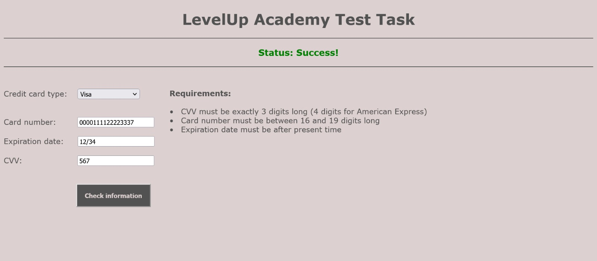
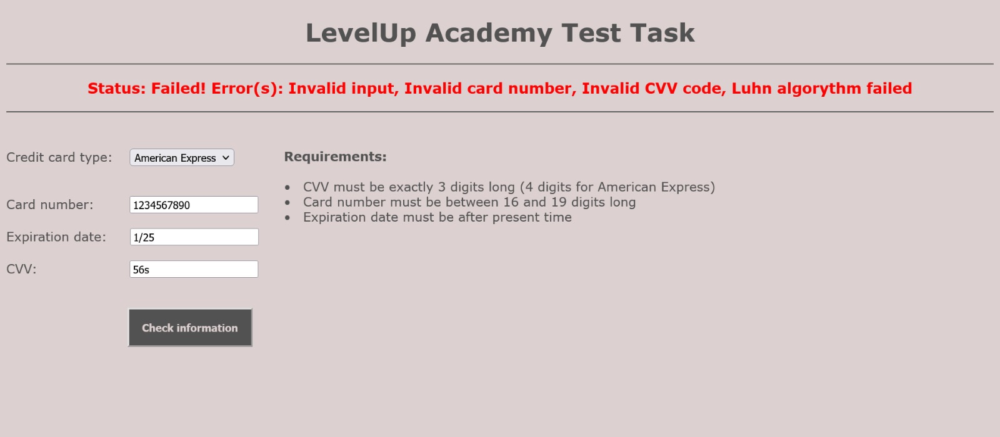

# LevelUp Academy Test Task

## A project made for LevelUp Academy as an admission assignment
<p align="justify">This is a project made for LevelUp Academy as an admission assigment. The task is to create a
simple backend API which communicates with the frontend in order to process entered credit card
information. The API verifies given inputs by checking if they are the correct format, length etc.
The expiration date is valid if it is after the present time, while the credit card number's validity
is checked using the Luhn algorithm. The status bar shows the result (green for success, red for fail) as
well as errors, in case the verification fails. The frontend is made using <i>JavaScript</i>,
while the backend uses <i>Java</i>.</p>

## Requirements:
+ **Java SE** - version 17.0.8 or later (https://www.oracle.com/java/technologies/java-se-glance.html)
+ **Apache Maven** - version 3.6.1 or later (https://maven.apache.org/download.cgi)

## How to use:

### Step 1: Install requirements
To check if you have _Java_ and _Maven_ installed and make sure the versions are as required, open your terminal and
run the `mvn -version` command. If everything is installed correctly, the output should look something like this:

```
Apache Maven 3.9.4 (...)
Maven home: <Path>
Java version: 17.0.8, vendor: Oracle Corporation, runtime: <Path>
Default locale: en_US, platform encoding: Cp1252
OS name: "windows 10", version: "10.0", arch: "amd64", family: "windows"
```

You can also run `java -version` separately to only check if _Java_ is installed.

If you get this message (when running the _Maven_ command):

```
'mvn' is not recognized as an internal or external command,
operable program or batch file.
```

or this message (when running the _Java_ command):

```
'java' is not recognized as an internal or external command,
operable program or batch file.
```

it means you don't have _Maven_ and/or _Java_ installed (or environment variables setup properly). For a simple guide on how to install _Java_ click
[here](https://java.tutorials24x7.com/blog/how-to-install-java-17-on-windows), and for _Maven_ instructions click [here](https://phoenixnap.com/kb/install-maven-windows).

### Step 2: Clone repository
The next step is to download the project by cloning this repository to your device. Extract the `.zip` file at a desired
location and enter the 'LevelUp-Academy-Test-Task-main' folder.

### Step 3: Build the project
Open the terminal inside the current folder and run the following command: `mvn install`. It will build the _Maven_ project
and get everything ready for use. If everything runs correctly, at the bottom you should see something like this:

```
[INFO] ------------------------------------------------------------------------
[INFO] BUILD SUCCESS
[INFO] ------------------------------------------------------------------------
[INFO] Total time:  23.598 s
[INFO] Finished at: 2023-10-03T17:13:33+02:00
[INFO] ------------------------------------------------------------------------
```

### Step 4: Run the project
If everything went well in **Step 3**, a folder named 'target' should appear. Run `cd target` to enter it through the terminal.
Once inside the 'target' folder, use `java -jar task-0.0.1-SNAPSHOP.jar` to run the program. After a few seconds it should be
ready for use.

> **Important**
> 
> Do NOT close the terminal or the connection will be lost!

> **Note**
>
> The default port (recommended) is 8080. If you want to run the program with a different port, add `--server.port=<PORT>` at
> the end of the _Java_ command. Example with port 8081:
>
> ```
> java -jar task-0.0.1-SNAPSHOT.jar --server.port=8081
> ```

### Step 5: Connect and play around
Open your web browser and type `localhost:<PORT>` in the search bar (default is `localhost:8080`). After the page loads, you
can start using the program. Choose your card type, put in your card information (card number, expiration date, and CVV code)
and click 'Check information' to get the result. Enjoy!

> **Warning**
> 
> Do NOT put in your real credit card information for security reasons!


Example of successful verification:




Example of failed verification:


